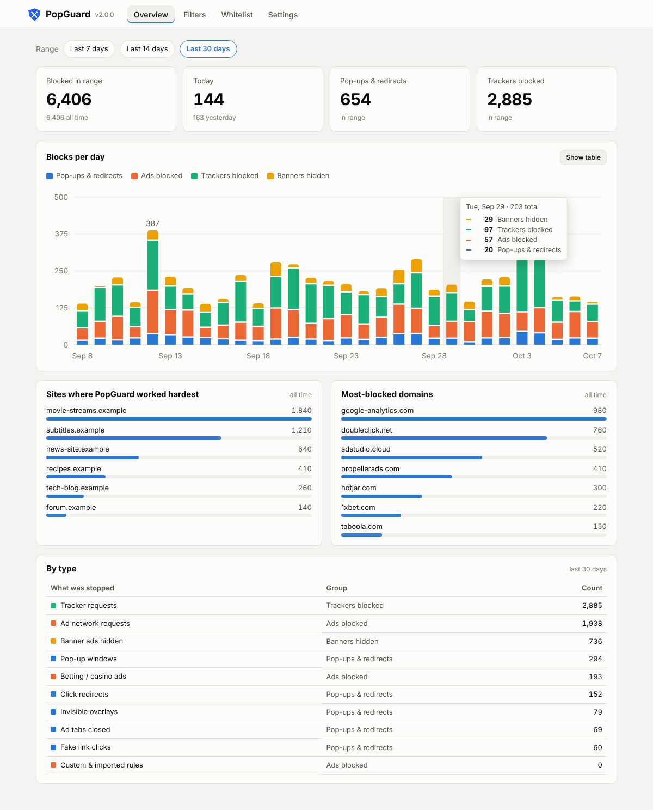
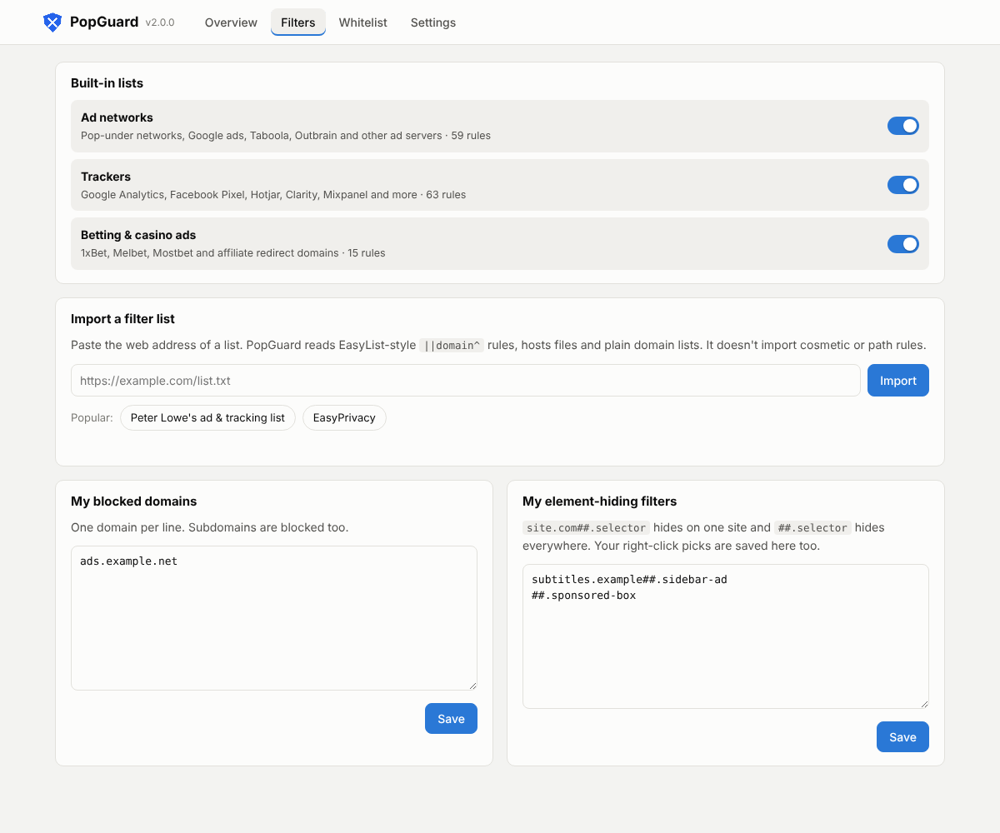
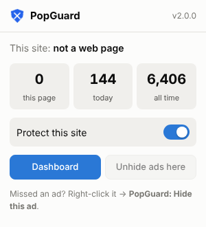
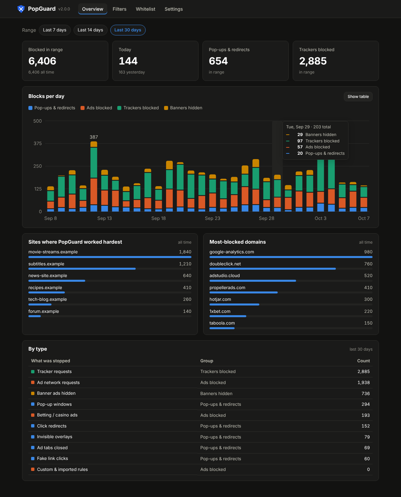
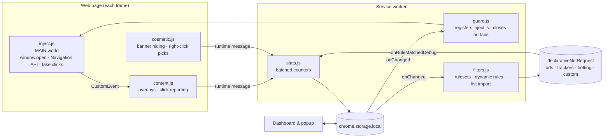

# PopGuard

**A Chrome extension that stops websites from hijacking your clicks.** It blocks pop-ups, click-redirects and invisible ad overlays, blocks ads and trackers, and shows exactly what it stopped on a statistics dashboard.



## Why I built it

On streaming and subtitle sites, clicking anywhere (the Play button, the page background, a menu) often opened an ad tab or sent the page to a betting site. It could take three or four clicks before the click did what I wanted. Normal ad blockers handle ad *requests* well, but these sites use behavioral tricks that change constantly:

| Trick | What it looks like | How PopGuard stops it |
|---|---|---|
| **Pop-under** | Clicking anywhere opens an ad window behind the page | Wraps `window.open` and allows it only when the user clicked a real link to that address |
| **Invisible overlay** | A see-through layer covers the page, so every click lands on an ad link | Finds large, transparent, high z-index layers on `pointerdown`, removes them, and forwards the click to the element underneath |
| **Tab-under** | The site reopens itself in a new tab and sends your current tab to an ad | Uses the Navigation API to cancel cross-site navigations right after a click when they don't match the clicked link |
| **Fake clicks** | A script creates a hidden `<a target=_blank>` and calls `.click()` | Intercepts `HTMLAnchorElement.click` and `dispatchEvent` for cross-site anchors |
| **Clean `window.open`** | A script grabs an unpatched `window.open` from a fresh iframe | Patches `contentWindow` so every frame gets the guarded version |
| **Ad tabs that slip through** | A new tab opens anyway | The service worker closes tabs a page opened unless the user clicked that link |

## Features

**V1: Click protection**

- Blocks pop-ups, pop-unders and tab-unders
- Blocks click-redirects to other sites, with an **Open anyway** notice for false positives
- Removes invisible click-jacking overlays

**V2: Network blocking**

- Ad-network, tracker and betting/casino rulesets (`declarativeNetRequest`), each can be switched on or off
- Hides banner ads using known selectors, plus a heuristic for banner-shaped images and iframes that link off-site
- Right-click → **PopGuard: Hide this ad** for anything it misses

**V3: Control and insight**

- **Statistics dashboard:** blocks per day (stacked by category, with a hover tooltip and a table view), totals, top sites, most-blocked domains, and a breakdown by type. Supports light and dark mode.
- **Custom filter lists:** import EasyList-style `||domain^`, hosts-file or plain domain lists by URL; add your own blocked domains and element-hiding filters (`site.com##.selector`)
- **Whitelist:** trusted sites get no blocking at all (a high-priority `allowAllRequests` rule plus excluded content-script matches)
- **Settings:** toggle each protection, export and import settings, reset statistics

| Filters | Popup | Dark mode |
|---|---|---|
|  |  |  |

## How it works



Design decisions worth calling out:

- **Two worlds.** The page-level guard must run in the page's own JavaScript world (`world: "MAIN"`) at `document_start`, before any site script, so it can patch `window.open`. Isolated-world scripts can't see page globals. The two halves talk through a `CustomEvent` carrying a JSON string, since objects don't cross worlds.
- **Settings without async in the page.** MAIN-world scripts can't read `chrome.storage`, so disabled features are passed in by registering tiny flag files (`content/flags/off-*.js`) ahead of `inject.js`.
- **Whitelist at the network layer.** A priority-100 `allowAllRequests` dynamic rule beats every block rule, so trusted sites load untouched.
- **Batched stats.** A busy page can trigger dozens of tracker blocks in a burst. Stats are buffered and written at most once per second through a promise chain, so writes never interleave.
- **No dependencies.** Extension pages can't load CDN scripts under Manifest V3, so the chart is a small hand-written SVG renderer (`ui/chart.js`). The chart palette was checked for color-blind safety.

## Install (developer mode)

1. Download or clone this repository.
2. Open `chrome://extensions` (it also works in Edge, Brave and Opera).
3. Turn on **Developer mode**.
4. Click **Load unpacked** and select the `extension/` folder.

## Tests

End-to-end tests load the real extension into Chromium with Playwright. They run it against fixture pages that copy each trick above, using `localhost` and `127.0.0.1` as two separate "sites".

```bash
npm install
npm test            # 12 end-to-end tests
npm run screenshots # also regenerates docs/screenshots (demo data)
```

The tests cover the following:

- Pop-up blocking, including a real link still opening
- Overlay removal with click pass-through
- Tab-under and fake-click blocking
- Banner hiding without hiding normal content
- Tracker and custom-domain blocking
- Statistics recording
- Filter-list import
- The whitelist and the feature toggles
- Dashboard rendering

## Project structure

```
extension/
  manifest.json
  background/   service-worker.js · guard.js · filters.js · stats.js
  content/      inject.js (MAIN world) · content.js · cosmetic.js · flags/
  rules/        ads.json · trackers.json · betting.json
  shared/       defaults.js (settings, kinds, helpers shared by every context)
  ui/           dashboard.* · chart.js · popup.* · theme.css
tests/          e2e.test.mjs · fixtures/
docs/           screenshots/
```

## Limitations and next steps

- Built-in lists are small and hand-picked (about 140 rules). For full coverage, import EasyPrivacy or Peter Lowe's list from the Filters page.
- Network-block statistics use `onRuleMatchedDebug`, which only works for unpacked installs. A Chrome Web Store build would switch to `getMatchedRules()`.
- Redirects started by cross-origin iframes, or more than 2 seconds after a click, aren't intercepted.
- The registrable-domain check is a heuristic, not the full Public Suffix List.
- Cosmetic rules from imported lists aren't supported yet.

## Tech

JavaScript (no framework), Chrome Extensions Manifest V3, `declarativeNetRequest`, the Navigation API, `scripting.registerContentScripts`, SVG, Playwright.

## License

MIT
